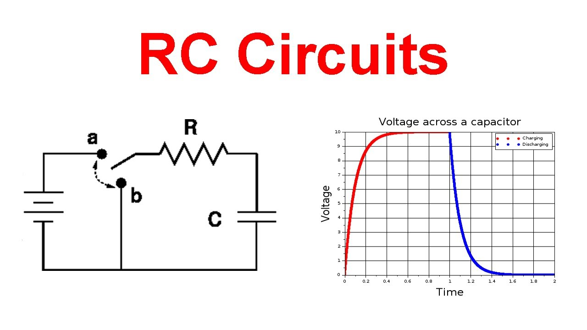

# TP d'ELECTRONIQUE - Guide Utilisateur

## 1. Objectifs  
- Obj1
- Obj2
- Obj3

## 2. sommaire
- **Part 1** : exemple  
- **Part 2** : exemple
- **Part 3** : exemple 

## 3. Part 1

### preparation

#### question 1

exemple de reponce

exemple de LaTeX

 Style en-ligne :
    $\lim_{n \to \infty}
    \sum_{k=1}^n \frac{1}{k^2}
    = \frac{\pi^2}{6}$.
exemple image

## 6. Ressources Complémentaires  
- [Documentation Arduino](https://www.arduino.cc/)  
- [Manuel de Fritzing](https://fritzing.org/documentation/)  
- [Cours d'électronique en ligne](https://example.com)  

